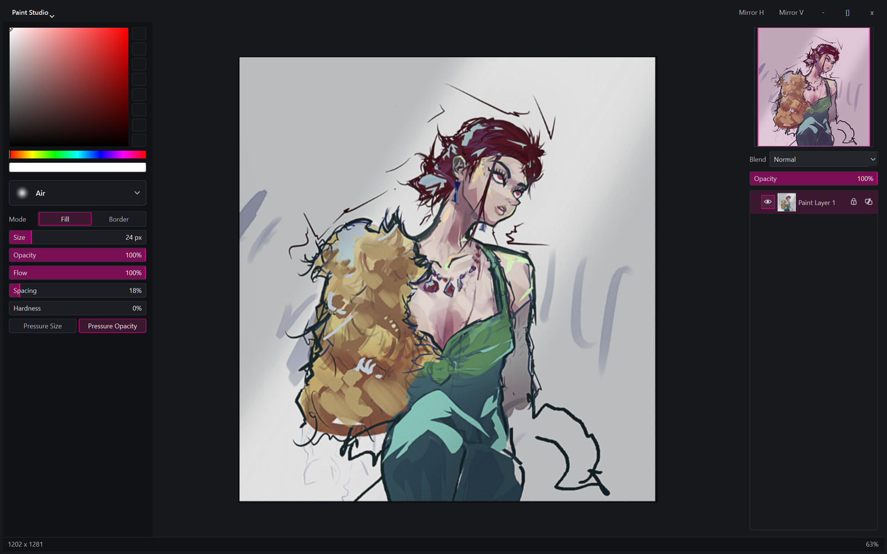

# Paint Studio

Custom painting app I use for quick edits, thumbnails and rough concept work. The canvas gets most of the window, with the brush and layer panels kept small on the side.

It has pressure brushes, layers and groups with blend modes, opacity, alpha lock and clipping masks, freehand selections, transforms, fill, a smart shape cleanup for rough strokes, crash recovery, and editable `.paintstudio` documents with PNG export. There's also a local JSON bridge, so scripts and AI agents can read the canvas and paint strokes into it.

## Running it

Made for Windows, other platforms are untested. Needs Python 3.12 or newer.

```bash
pip install PySide6 numpy
python launch.pyw
python tools/check.py
```

New documents go in `Documents/PaintStudioData`. If you make a `PaintStudioData` folder next to the app it uses that one instead, so it can stay portable.

Closing the window saves the painting as a project and leaves a blank canvas for next time. `Quit Paint Studio` in the title menu does a full exit, and `Open Recent` reopens saved projects with their full undo history.

## Controls

- Click `Paint Studio` in the title bar for the document menu
- `Space` tap to fit and center the canvas, hold and drag to pan
- Top-right navigator recenters on click or drag, zooms with the wheel and fits on double-click
- `Shift+Space` and drag an edge to crop in or reveal painted pixels past the edge (nothing gets erased)
- `End` does the destructive trim
- `M` mirrors the view horizontally, Mirror H and Mirror V in the title bar flip each axis without changing saved pixels
- `C` opens a small color picker under the pointer, releasing on the hue strip keeps it open and releasing in the square picks the color
- `Q` freehand selection, with `Shift` to add, `Alt` to subtract and `Shift+Alt` to intersect
- `Ctrl+T` transforms the selection or selected layers (move, scale, rotate, skew, perspective, pivot), `Enter` applies and `Esc` cancels
- `Ctrl+N` or `Ctrl+W` saves the current painting as a project and starts a new one, a failed save keeps the canvas
- Checkerboard background toggle in the title menu, the default is dark gray

## Layers

- `Insert` new layer
- `'` toggles visibility
- `Ctrl+G` groups the selected layers
- `Home` copies the visible result to a new layer
- `Delete` clears the current layer's pixels (respects the selection, undoable)
- Drag rows to reorder or move them into groups, right-click the list to create, duplicate, group, rename or delete

## Brushes

- `1` Air, `2` Ink, `3` Paint, `4` Shape, `5` Blur, `6` Stamp, `F` or `7` Fill
- Each brush keeps its own settings between launches
- `E` toggles the eraser for whichever brush is active, `B` goes back to painting
- Fill has opacity, threshold and a current layer or all visible reference

## Smart Shape

On by default, toggle it in the title menu. Draw a rough shape with any freehand brush (or its eraser) and hold the pointer still for 0.7 seconds. It keeps the sides and corners you drew but straightens the flat runs, smooths the curves and snaps strong ellipses, and the clean path flashes when it triggers. Keep holding and move to scale and rotate it, then release to commit it as one undo. `Esc` while still holding goes back to the original stroke.

## Local bridge

A running instance takes JSON commands over a local socket. Scripts and AI agents can use it to check the canvas, add layers and paint stroke bundles, which render once and commit as one undo.

```bash
python tools/paint_api.py '{"command":"canvas_info"}'
```

`canvas_png` writes the canvas to `PaintStudioData/Bridge`, and `canvas_check` tells you if that file still matches the live document. The full command list is in [docs/backend-api.md](docs/backend-api.md).
